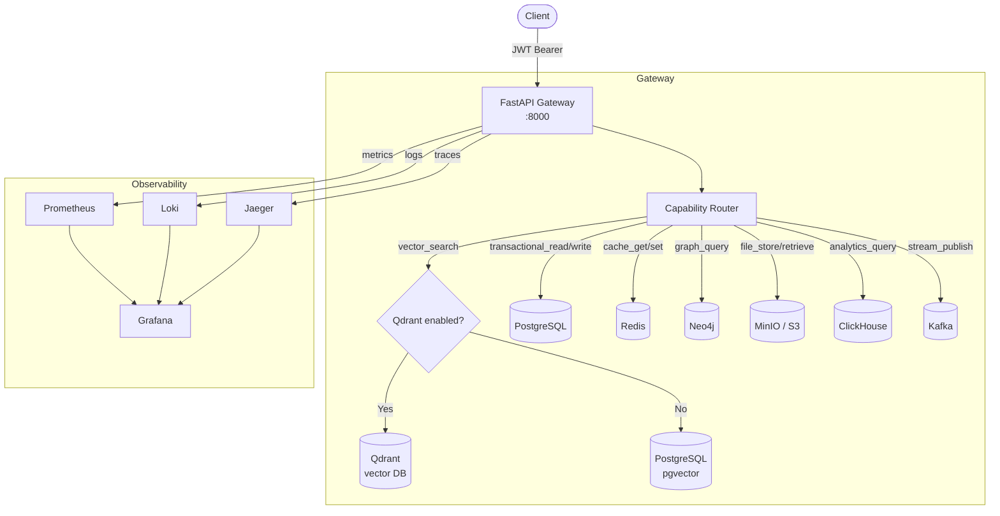
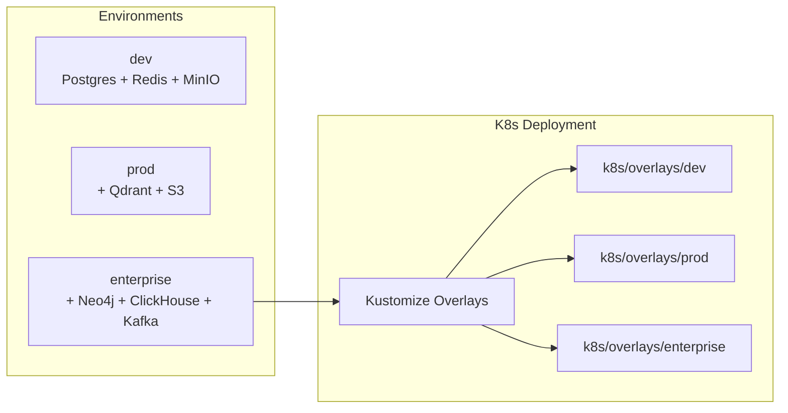

# Ascended Unified Database

A **production-grade polyglot database orchestration platform** that unifies PostgreSQL (with pgvector), Redis, Qdrant, Neo4j, ClickHouse, Kafka, and MinIO/S3 behind a single FastAPI gateway with capability-based routing, JWT authentication, and full observability.

---

## Architecture





---

## Quick Start

### 1. Clone and configure

```bash
git clone https://github.com/ascended/unified-database
cd Ascended-Unified-Database
cp .env.example .env
# Edit .env with your passwords and secrets
```

### 2. Start the dev stack (Docker Compose)

```bash
docker compose -f docker/docker-compose.dev.yml up --build
```

### 3. Initialize the database

```bash
POSTGRES_HOST=localhost POSTGRES_PASSWORD=yourpassword \
  bash scripts/init-db.sh
```

### 4. Obtain a JWT token

```bash
curl -X POST http://localhost:8000/auth/token \
  -H "Content-Type: application/json" \
  -d '{"username": "admin", "password": "your-password"}'
```

### 5. Run your first query

```bash
TOKEN="<your-jwt-token>"

# Vector search (falls back to pgvector in dev)
curl -X POST http://localhost:8000/gateway/query \
  -H "Authorization: Bearer $TOKEN" \
  -H "Content-Type: application/json" \
  -d '{
    "operation": "vector_search",
    "dataset": "documents",
    "vector": [0.1, 0.2, 0.3],
    "top_k": 5
  }'
```

---

## Environment Switching

The gateway reads the `ENVIRONMENT` env var and loads `configs/{environment}.yaml`:

| Environment  | Enabled Databases                              | Config File             |
|--------------|------------------------------------------------|-------------------------|
| `dev`        | Postgres, Redis, MinIO                         | `configs/dev.yaml`      |
| `prod`       | Postgres, Redis, Qdrant, S3                    | `configs/prod.yaml`     |
| `enterprise` | Postgres, Redis, Qdrant, Neo4j, ClickHouse, Kafka, MinIO | `configs/enterprise.yaml` |

```bash
# Switch to production
ENVIRONMENT=prod docker compose -f docker/docker-compose.prod.yml up

# Switch to enterprise
ENVIRONMENT=enterprise docker compose -f docker/docker-compose.enterprise.yml up
```

---

## API Usage

### Authentication

All `/gateway/*` and `/admin/*` routes require a Bearer JWT token.

```bash
# Get token
curl -X POST http://localhost:8000/auth/token \
  -d '{"username": "user", "password": "pass"}'

# Use token
curl -H "Authorization: Bearer $TOKEN" http://localhost:8000/gateway/query ...
```

### Operations Reference

| Operation           | Required Fields        | Routed To                         |
|---------------------|------------------------|-----------------------------------|
| `vector_search`     | `vector`, `dataset`    | Qdrant (if enabled) → pgvector    |
| `transactional_read`| `sql` or `query`       | PostgreSQL                        |
| `transactional_write`| `sql` or `query`      | PostgreSQL                        |
| `cache_get`         | `key`                  | Redis                             |
| `cache_set`         | `key`, `data`          | Redis                             |
| `graph_query`       | `cypher` or `query`    | Neo4j                             |
| `file_store`        | `object_key`, `data`   | MinIO / S3                        |
| `file_retrieve`     | `object_key`           | MinIO / S3                        |
| `analytics_query`   | `sql` or `query`       | ClickHouse                        |
| `stream_publish`    | `topic`, `data`        | Kafka                             |

### Example: Transactional Read

```bash
curl -X POST http://localhost:8000/gateway/query \
  -H "Authorization: Bearer $TOKEN" \
  -H "Content-Type: application/json" \
  -d '{
    "operation": "transactional_read",
    "dataset": "users",
    "sql": "SELECT id, email FROM users LIMIT 10"
  }'
```

### Example: Cache Set/Get

```bash
# Set
curl -X POST http://localhost:8000/gateway/query \
  -H "Authorization: Bearer $TOKEN" \
  -d '{"operation": "cache_set", "dataset": "cache", "key": "user:42", "data": {"name": "Alice"}, "ttl": 3600}'

# Get
curl -X POST http://localhost:8000/gateway/query \
  -H "Authorization: Bearer $TOKEN" \
  -d '{"operation": "cache_get", "dataset": "cache", "key": "user:42"}'
```

### Admin API

Requires `admin` role in JWT.

```bash
# List all databases and their status
curl -H "Authorization: Bearer $ADMIN_TOKEN" http://localhost:8000/admin/databases

# Health check all databases
curl -H "Authorization: Bearer $ADMIN_TOKEN" http://localhost:8000/admin/health

# Enable a database at runtime
curl -X POST http://localhost:8000/admin/databases/qdrant/enable \
  -H "Authorization: Bearer $ADMIN_TOKEN" \
  -d '{"reason": "Traffic spike requires vector search"}'
```

---

## Kubernetes Deployment

### Using Kustomize

```bash
# Dev
kubectl apply -k k8s/overlays/dev

# Production
kubectl apply -k k8s/overlays/prod

# Enterprise (full stack)
kubectl apply -k k8s/overlays/enterprise
```

### Create required secrets first

```bash
kubectl create secret generic gateway-secrets \
  --from-literal=JWT_SECRET_KEY="$JWT_SECRET_KEY" \
  -n ascended-db

kubectl create secret generic postgres-secrets \
  --from-literal=POSTGRES_PASSWORD="$POSTGRES_PASSWORD" \
  --from-literal=POSTGRES_USER=postgres \
  -n ascended-db

kubectl create secret generic redis-secrets \
  --from-literal=REDIS_PASSWORD="$REDIS_PASSWORD" \
  -n ascended-db
```

---

## Helm Usage

### Install the full stack

```bash
# Install with dev values
helm install ascended ./helm/full-stack-chart \
  --namespace ascended-db \
  --create-namespace \
  --set global.environment=dev \
  --set-string gateway.secrets.JWT_SECRET_KEY="$JWT_SECRET_KEY"

# Upgrade to prod
helm upgrade ascended ./helm/full-stack-chart \
  --set global.environment=prod \
  --set qdrant.enabled=true
```

### Install individual charts

```bash
helm install pg ./helm/postgres-chart -n ascended-db
helm install redis ./helm/redis-chart -n ascended-db
helm install gateway ./helm/gateway-chart -n ascended-db
```

---

## CI/CD Workflows

| Workflow               | Trigger                     | Actions                            |
|------------------------|-----------------------------|------------------------------------|
| `ci.yml`               | Any push / PR               | Lint, security scan, Docker build, tests |
| `validation.yml`       | Any push / PR               | Config schema + placeholder checks |
| `cd-dev.yml`           | Push to `dev` branch        | Build image, deploy to dev K8s     |
| `cd-prod.yml`          | Push to `main` branch       | Build image, manual approval, blue/green deploy |
| `cd-enterprise.yml`    | Push tag `v*-enterprise`    | Build image, canary rollout        |

---

## Scaling Strategy

### Horizontal Pod Autoscaler

The gateway HPA scales on CPU (70%) and memory (80%), min 2 → max 10 replicas.

### KEDA (Enterprise)

Kafka consumer lag-based scaling:
- Scale up when `ascended.tasks` lag exceeds 50 messages
- Min 2 replicas, max 20 replicas

### Database Scaling

- **PostgreSQL**: vertical scaling; use read replicas for read-heavy workloads.
- **Qdrant**: add nodes to cluster for horizontal vector sharding.
- **Redis**: Redis Cluster for >single-node throughput.
- **ClickHouse**: horizontal sharding on cluster.
- **Kafka**: increase partition count + consumer group replicas.

---

## Disaster Recovery

| Component    | Strategy                                      | RPO / RTO         |
|--------------|-----------------------------------------------|-------------------|
| PostgreSQL   | WAL archiving to S3, daily pg_dump            | RPO 5min / RTO 30min |
| Redis        | AOF persistence + RDB snapshots               | RPO 1min / RTO 10min |
| Qdrant       | Collection snapshots to object storage        | RPO 1hr / RTO 20min |
| Neo4j        | Online backup to S3                           | RPO 15min / RTO 30min |
| ClickHouse   | ReplicatedMergeTree + backup to S3            | RPO 5min / RTO 60min |
| Kafka        | Topic replication factor ≥ 3, MirrorMaker 2  | RPO ~0 / RTO 10min |
| Object Storage | S3 cross-region replication                 | RPO ~0 / RTO ~0   |

---

## Security Overview

- **Authentication**: JWT HS256 tokens, configurable expiry per environment.
- **Authorization**: Role-based access control (`admin`, `developer`, `viewer`).
- **Transport**: TLS enforced via NGINX Ingress with cert-manager.
- **Network**: Zero-trust Kubernetes NetworkPolicies — databases only reachable from gateway pods.
- **Secrets**: All credentials via environment variables / Kubernetes Secrets. No hardcoded values.
- **Container security**: Non-root user, read-only filesystem, all Linux capabilities dropped.
- **Rate limiting**: In-process token bucket (600 req/min default), configurable.
- **Security headers**: HSTS, X-Frame-Options, CSP, etc. via middleware.
- **Audit log**: Every write operation logged to `audit_log` table with user, IP, timestamp.

---

## Project Structure

```
.
├── configs/                  # Environment-specific YAML configs
│   ├── dev.yaml
│   ├── prod.yaml
│   └── enterprise.yaml
├── gateway/                  # FastAPI gateway service
│   ├── Dockerfile
│   ├── requirements.txt
│   └── app/
│       ├── main.py           # App factory, lifespan, middleware
│       ├── core/
│       │   ├── config.py     # Config loader with env interpolation
│       │   ├── auth.py       # JWT auth, RBAC
│       │   └── security.py   # Rate limiting, security headers
│       ├── models/
│       │   └── requests.py   # Pydantic models
│       ├── providers/        # Database-specific clients
│       │   ├── postgres_provider.py
│       │   ├── redis_provider.py
│       │   ├── qdrant_provider.py
│       │   ├── neo4j_provider.py
│       │   ├── minio_provider.py
│       │   ├── clickhouse_provider.py
│       │   └── kafka_provider.py
│       ├── routes/           # FastAPI routers
│       │   ├── gateway.py
│       │   ├── admin.py
│       │   └── health.py
│       └── services/
│           └── router.py     # Capability-based routing logic
├── schemas/                  # Database schemas
│   ├── postgres.sql
│   ├── graph.cypher
│   └── qdrant.json
├── scripts/                  # Operational scripts
│   ├── init-db.sh
│   └── migrate.sh
├── docker/                   # Docker Compose stacks
├── k8s/                      # Kubernetes manifests
├── helm/                     # Helm charts
├── tools/validator/          # Validation tooling
└── .github/workflows/        # CI/CD pipelines
```
