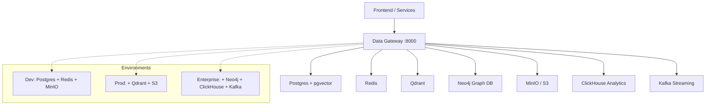
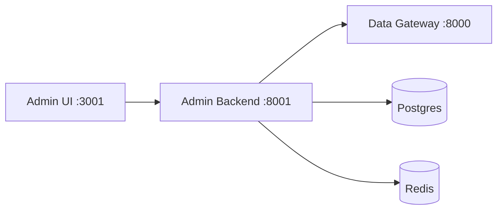

# Architecture Overview

## Guiding Principles

```
Infrastructure defines availability
      Gateway defines behavior
         Services define intent
```

The three-layer separation is non-negotiable:

1. **Infrastructure Layer** (`docker/`, `k8s/`, `helm/`, `configs/`) — defines *what databases exist* and *which tier they run in*
2. **Gateway Layer** (`gateway/`) — decides *which database handles each request* based on environment and capability
3. **Service Layer** (your apps) — expresses *what it needs* using capability operations, never naming a specific database

---

## System Flowchart



---

## Environment Tiers

| Database | Dev | Production | Enterprise |
|----------|-----|-----------|-----------|
| Postgres + pgvector | ✅ | ✅ | ✅ |
| Redis | ✅ | ✅ | ✅ |
| MinIO / Object Storage | ✅ (MinIO) | ✅ (S3) | ✅ (S3) |
| Qdrant | ❌ | ✅ | ✅ |
| Neo4j Graph | ❌ | ❌ | ✅ |
| ClickHouse Analytics | ❌ | ❌ | ✅ |
| Kafka Streaming | ❌ | ❌ | ✅ |

---

## Component Breakdown

### Infrastructure Layer
Defined in `docker/`, `k8s/`, `helm/`, and `configs/`.

Responsibilities:
- Which databases run in each environment
- Provisioning, networking, and storage
- Environment-specific resource limits and replicas
- Secrets and connection strings

### Gateway Layer
Defined in `gateway/`.

Responsibilities:
- Receive capability requests from services
- Route to the correct provider based on environment config
- Authentication and authorization (JWT + RBAC)
- Connection pooling and error handling
- Prometheus metrics, OpenTelemetry tracing

### Service Layer
Your applications.

Responsibilities:
- Express *intent* through capability operations
- Call the Data Gateway API — never a database directly
- Parse gateway responses

---

## Admin Control Plane



The Admin Panel sits *alongside* the gateway, not inside it. It:
- Manages database connection registrations (stored in Postgres)
- Provides health checks and live metrics via WebSocket
- Controls enable/disable of database providers at runtime
- Exposes a JSON metrics API consumable by any external monitoring system
- Manages users and audit logs across the full stack

---

## Security Boundary

```
Internet → [Ingress / TLS] → [Gateway] → [Databases]
                                 ↑
                            JWT required
                            RBAC enforced
                         Rate limit applied
```

Databases have `NetworkPolicy` rules that allow connections **only from the gateway namespace**. No external access to database ports.

---

## Technology Stack (2026)

| Layer | Technology | Version |
|-------|-----------|---------|
| Gateway runtime | Python | 3.12 |
| Gateway framework | FastAPI | 0.111 |
| Admin backend | FastAPI | 0.111 |
| Admin frontend | Next.js | 15.0.8 |
| Frontend styling | Tailwind CSS | 3.4 |
| Container runtime | Docker | 26+ |
| Orchestration | Kubernetes | 1.30+ |
| Package management | Helm | 3 |
| Config overlays | Kustomize | 5 |
| CI/CD | GitHub Actions | — |
| Metrics | Prometheus | 2.x |
| Dashboards | Grafana | 10.x |
| Log aggregation | Loki | 3.x |
| Distributed tracing | Jaeger | 1.x |
